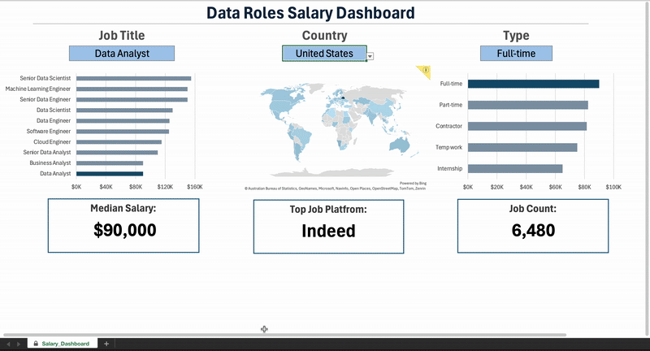
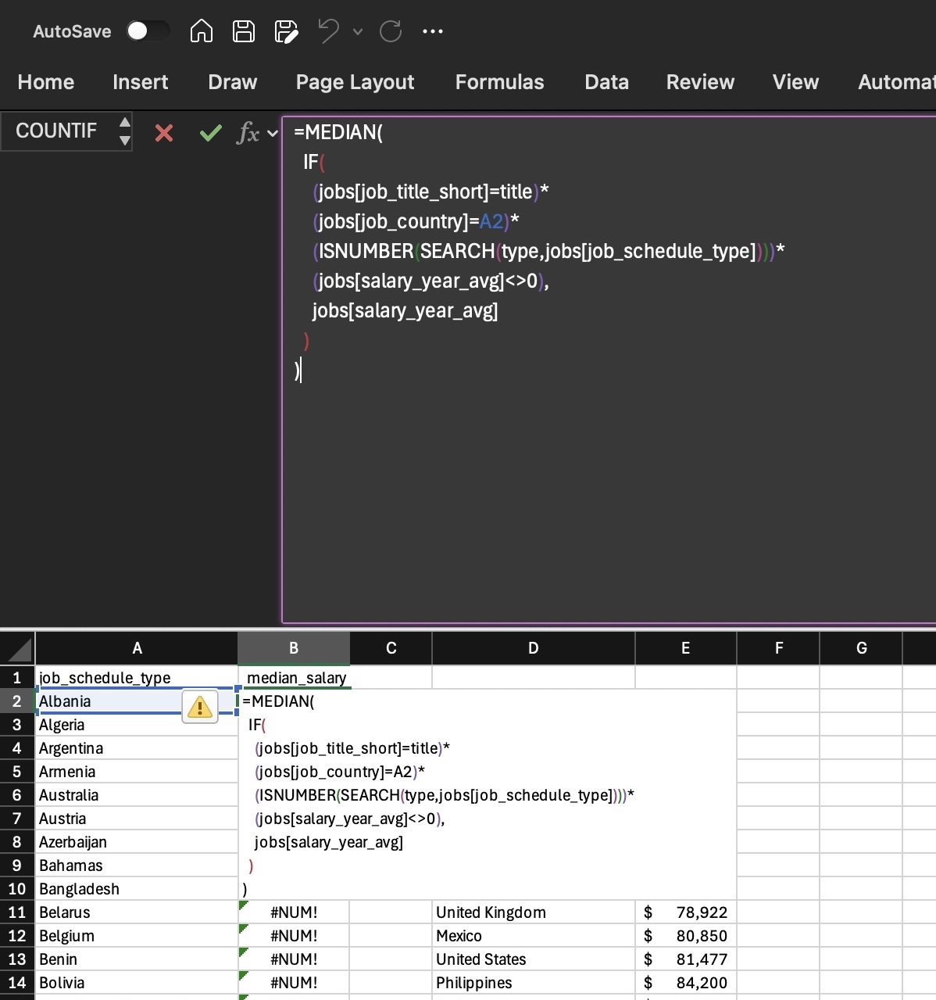
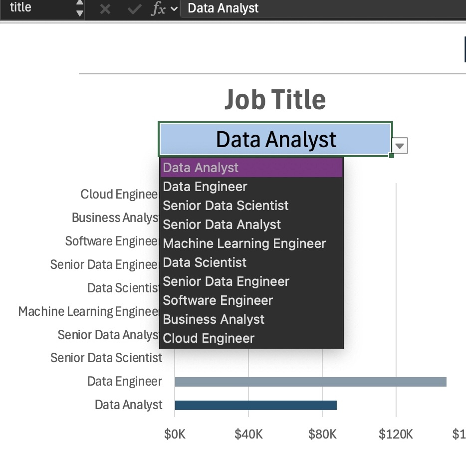
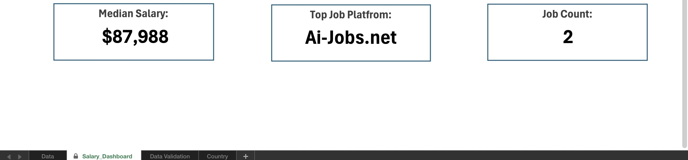

# Excel-Salary-Dashboard

# 📊 Global Data Science Salary Dashboard

*A dynamic Excel dashboard analyzing 32,000+ real-world job postings to reveal salary trends across the globe.*

## 📝 Project Overview
This project analyzes the data science job market to answer key questions: **Which roles pay the most? Which countries offer the best opportunities? And does working remotely impact salary?**

I analyzed 32,000+ rows of data to build a tool that allows users to filter jobs by Role, Country, and Experience level.

## ⚙️ Technical Deep Dive: How It Works

### 1. The "Engine": Complex Array Formulas
The core challenge was calculating the **Median Salary** dynamically, as standard Pivot Tables cannot calculate Medians easily.

I engineered a multi-conditional array formula using `AGGREGATE` to handle errors and filter data on the fly without helper columns.

*The actual array formula used to calculate dynamic medians based on user selection.*

---

### 2. Data Validation & User Control
To prevent user errors and ensure the dashboard calculates correctly, I implemented **Data Validation** lists. This ensures that users can only select valid Roles, Countries, and Schedule Types from the backend database.

*Restricted dropdown lists ensure data integrity.*

---

### 3. Dynamic KPI Board
The top layer of the dashboard features real-time Key Performance Indicators (KPIs) that update instantly based on the slicer selection. These metrics (Median Salary, Job Count, Platform) use `SUBTOTAL` and `COUNTIFS` logic to recalculate based on the filtered data subset.

*Real-time metrics adjusting to user filters.*

---

## 🚀 How to Use
1. Download the file `Salary_Dashboard.xlsx`.
2. Open in Microsoft Excel.
3. Navigate to the **"Salary Dashboard"** tab.
4. Use the slicers/dropdowns on the left to filter the data.
